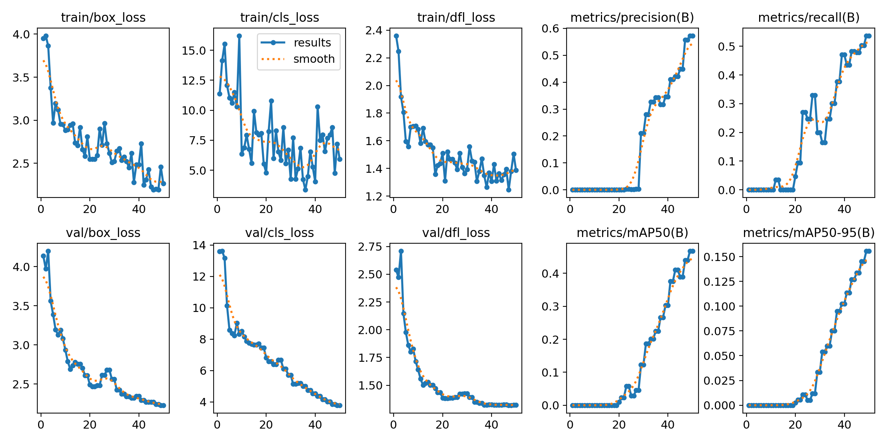

# object_detection_Sentinel2
# 🛰️ Sentinel-2 Multispectral Ship Detection: Weak Supervision & Epistemic Uncertainty

## 📌 Project Overview
This repository contains a full-stack Machine Learning pipeline for maritime vessel detection using **multispectral satellite imagery** (Sentinel-2). Standard Object Detection models rely on 3-channel RGB data, which often fails under heavy cloud cover, haze, or shadows. 

To solve this, I engineered a custom **4-channel YOLOv11 architecture** that dynamically ingests **Near-Infrared (NIR)** bands alongside RGB. Due to the lack of ground-truth bounding boxes for raw Sentinel-2 data, this project explores the MLOps lifecycle from Weak Supervision (heuristic OpenStreetMap labels) to Data-Centric AI (human-in-the-loop fine-tuning), heavily utilizing probabilistic math to diagnose dataset bias.

---

## 🔬 Key Engineering Highlights

* **Cloud-Native Data Ingestion:** Automated fetching of 10km x 10km multi-band satellite chips via the Planetary Computer STAC API.
* **Architecture Surgery:** Modified the foundational PyTorch convolutional layers of YOLOv11 to accept 4-channel (`[R, G, B, NIR]`) tensor inputs without destroying pre-trained RGB weights.
* **Epistemic Uncertainty Quantification:** Engineered a custom PyTorch `forward_hook` to inject stochastic Monte Carlo Dropout during inference, bypassing deterministic point-estimates to visualize spatial variance.
* **Ablation & Robustness Testing:** Evaluated model degradation against simulated atmospheric/sensor noise (Gaussian injection).

---

## 📊 Evaluation & Diagnostics

### 1. Probabilistic Spatial Bias Diagnosis
Initially, to avoid manual labeling, I utilized a **Weak Supervision** pipeline using OpenStreetMap centroid coordinates. To evaluate the spatial confidence of this approach, I applied 10 stochastic forward passes using **Monte Carlo Dropout (15%)** to generate an epistemic uncertainty heatmap.


> **Figure 1: Heatmap of Doubt.** *Deep red indicates high model consensus; blue indicates high epistemic doubt.* > **Analysis:** The heatmap successfully visualized a critical data bias: the model learned to detect the *geographical center of harbor inlets* rather than maritime vessels. This proved the weak OSM labels were insufficient and guided the pivot to a Data-Centric AI approach.

### 2. Architecture Robustness vs. SNR Decay
To test the resilience of the 4-channel model against severe weather and poor sensor quality, I conducted an ablation study by injecting incremental levels of standard Gaussian noise ($\sigma$) across all channels.


> **Figure 2: Architecture Robustness.** *Relative mAP Retention vs. Simulated Sensor/Atmospheric Noise.*
> **Analysis:** The steep degradation curve highlights the fragility of models trained on purely heuristic center-point labels. Because the model overfit to pristine background water textures, it suffered catastrophic failure when noise disrupted those textures.

### 3. Data-Centric Intervention & Convergence
Using the insights from the Monte Carlo and SNR diagnostics, I executed a **Data-Centric intervention**. I discarded the OSM labels and manually annotated a highly-curated 50-image subset using precise bounding boxes around true maritime targets, enabling high-quality Transfer Learning.


> **Figure 3: Training Convergence.** *Loss and precision metrics over 50 epochs.*
> **Analysis:** Despite the structural modifications required to force YOLO to accept 4-channel NIR tensors, the custom architecture successfully converged. The model effectively decoupled the ships from the background harbor noise, proving the viability of the multispectral weights.

---

## 🛠️ Repository Structure

* `prepare_dataset.py`: Merges raw 4-channel `.tif` imagery with curated YOLO `.txt` labels and generates the train/val split structure.
* `train.py`: Contains the PyTorch layer surgery script to upgrade standard YOLO to 4 channels, and executes the fine-tuning loop.


## 🚀 Quick Start
1. Clone the repository and install requirements:
   ```bash
   pip install ultralytics rasterio torch torchvision pandas

2. Build the final paired dataset:
   ```bash
   python prepare_dataset.py
3. Initialize the 4-channel model and start training:
    ```bash
    python train.py
   
  
